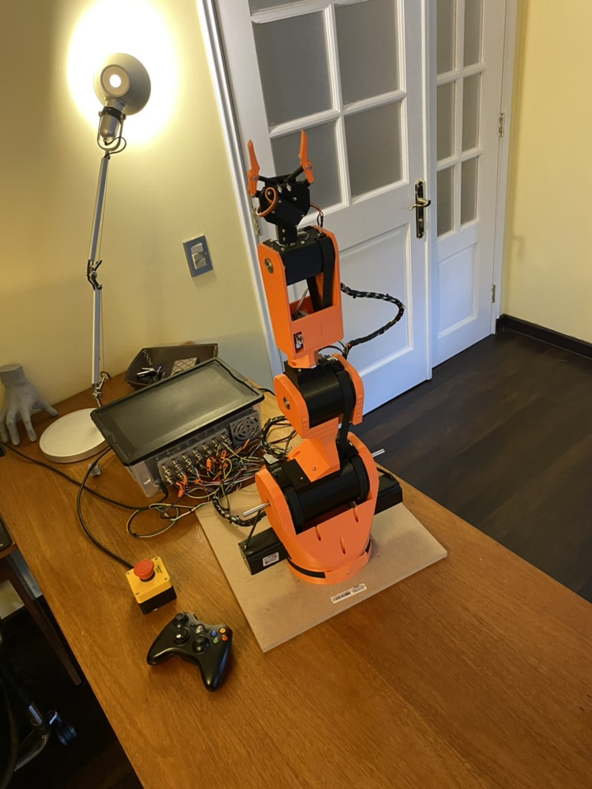
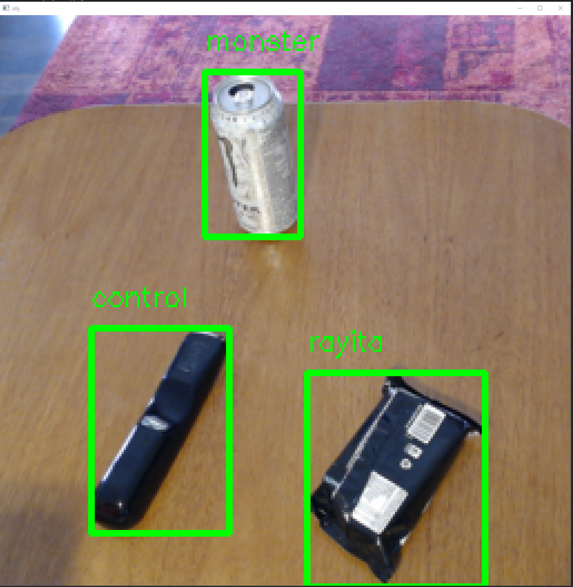
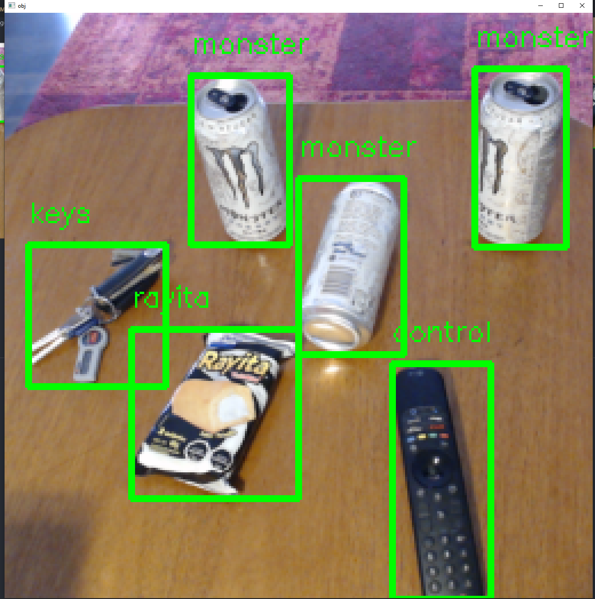

# Hi 👋 

My name is Alberto Abarzua, I'm studying Computer Science 💻 (Ingenieriai Civil en Ciencas de la Computacion) at Universad de Chile (Santiago, Chile).

- 📫 How to reach me: 
  - Mail: aabarzua@palvi.cl

# 🔭 Current Main Projects 🔭:

## 🦾 3D Printed Robot Arm:

 This project consists of a 3D printable robot arm (6DOF) with it's controlling software and firmware all coded from scratch.

 
 

[Go to RobotArm repository](https://github.com/alberto-abarzua/3d_printed_robot_arm)

## ✨ Computer Vision for Robot Arm.
Newest project with the objective of controlling the robot-arm's movements employing object detection via computer vision using a webcam.

This project is at a very early stage. These are some examples of what works for the moment.

### Examples

 

 

[Go to CV repository](https://github.com/alberto-abarzua/computer_vision_experiments)
